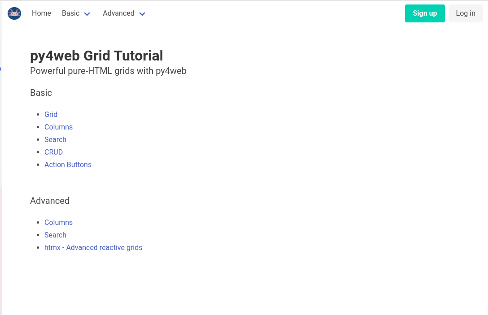

# Getting Started

This guide assumes that you have some familiarity with py4web, pydal, and yatl.  It is
not meant as an all-encompassing guide to using py4web, it is focused on the details 
of implementing grids into your applications.

The py4web manual shows how to install: 

[Installing from pip](https://py4web.com/_documentation/static/en/chapter-03.html#installing-from-pip)

or 

[Installing using a virtual environment](https://py4web.com/_documentation/static/en/chapter-03.html#installing-using-a-virtual-environment)

## Creating the Grid Tutorial Application

We will be creating a sample application that is based off the _scaffold app included in py4web.

- Locate the apps directory that you created in the install process (py4web setup apps)
- Inside the apps directory copy the _scaffold directory and all its contents to a new directory call grid_tutorial
- start up py4web with the `py4web run apps` command
- Point your browser to http://127.0.0.1:8000/grid_tutorial and you should see the default py4web _scaffold start page.

## Style for Grid Tutorial application
Now that we have py4web working, let's change up that default page. To do this we're simply going to copy and 
paste some text into a few files. py4web defaults to using no.css as it's css framework. For
this project we're going to use Bulma.

First we're going to replace everything in templates/layout.html with the following:

```html
<!DOCTYPE html>
<html>
  <head>
    <meta charset="utf-8">
    <meta name="viewport" content="width=device-width, initial-scale=1">
    <title>Hello Bulma!</title>
    <link rel="stylesheet" href="https://cdn.jsdelivr.net/npm/bulma@0.9.3/css/bulma.min.css">
    <link rel="stylesheet" href="https://cdnjs.cloudflare.com/ajax/libs/font-awesome/5.14.0/css/all.min.css" integrity="sha512-1PKOgIY59xJ8Co8+NE6FZ+LOAZKjy+KY8iq0G4B3CyeY6wYHN3yt9PW0XpSriVlkMXe40PTKnXrLnZ9+fkDaog==" crossorigin="anonymous" />
    <style>.py4web-validation-error{margin-top:-16px; font-size:0.8em;color:red}</style>
    [[block page_head]]<!-- individual pages can customize header here -->[[end]]
  </head>
  <body>
<nav class="navbar" role="navigation" aria-label="main navigation">
  <div class="navbar-brand">
    <a class="navbar-item" href="https://py4web.com">
      
    </a>

    <a role="button" class="navbar-burger" aria-label="menu" aria-expanded="false" data-target="navbarBasicExample">
      <span aria-hidden="true"></span>
      <span aria-hidden="true"></span>
      <span aria-hidden="true"></span>
    </a>
  </div>

  <div id="navbarBasicExample" class="navbar-menu">
    <div class="navbar-start">
      <a href="[[=URL('index') ]]" class="navbar-item">
        Home
      </a>
      <div class="navbar-item has-dropdown is-hoverable">
        <a class="navbar-link">
          Basic
        </a>

        <div class="navbar-dropdown">
          <a href="[[=URL('basic_grid') ]]" class="navbar-item">
            Grid
          </a>
          <a href="[[=URL('columns') ]]" class="navbar-item">
            Columns
          </a>
          <a href="[[=URL('search') ]]" class="navbar-item">
            Search
          </a>
          <a href="[[=URL('crud') ]]" class="navbar-item">
            CRUD
          </a>
          <a href="[[=URL('action_buttons') ]]" class="navbar-item">
            Action Buttons
          </a>
        </div>
      </div>
      <div class="navbar-item has-dropdown is-hoverable">
        <a class="navbar-link">
          Advanced
        </a>

        <div class="navbar-dropdown">
          <a href="[[=URL('advanced_columns') ]]" class="navbar-item">
            Columns
          </a>
          <a href="[[=URL('advanced_search') ]]" class="navbar-item">
            Search
          </a>
          <a href="[[=URL('advanced_htmx') ]]" class="navbar-item">
            htmx - Advanced reactive grids
          </a>
        </div>
      </div>
    </div>

    <div class="navbar-end">
      <div class="navbar-item">
        <div class="buttons">
          [[if globals().get('user'):]]
            [[=globals().get('user',{}).get('email')]]
            <a href="[[=URL('auth/profile')]]" class="button is-light">
              <strong>Profile</strong>
            </a>
            <a href="[[=URL('auth/change_password')]]" class="button is-light">
              <strong>Change Password</strong>
            </a>
            <a href="[[=URL('auth/logout')]]" class="button is-light">
              <strong>Logout</strong>
            </a>
          [[else: ]]
            <a href="[[=URL('auth/register')]]" class="button is-primary">
              <strong>Sign up</strong>
            </a>
            <a href="[[=URL('auth/login')]]" class="button is-light">
              Log in
            </a>
          [[pass ]]
        </div>
      </div>
    </div>
  </div>
</nav>  <section class="section">
    <div class="container">
      <div>
        <!-- Flash alert messages, first optional one in data-alert -->
        <flash-alerts class="padded" data-alert="[[=globals().get('flash','')]]"></flash-alerts>
      </div>
      <h1 class="title">
        py4web Grid Tutorial
      </h1>
      <p class="subtitle">
        Powerful pure-HTML grids with py4web
      </p>
      <main class="padded">
        [[include]]
      </main>
    </div>
  </section>
  </body>
  <script src="js/utils.js"></script>
  [[block page_scripts]]<!-- individual pages can add scripts here -->[[end]]
</html>
```

From the grid_tutorial repo copy the /static/images directory to your application directory. This
will get all the tutorial icons and such copied to your application.

Next we'll cut and paste the following block into templates/index.html, replacing everything that is there.
```html
[[extend 'layout.html']]

<div class="subtitle">Basic</div>
<div class="content">
<ul>
    <li>
          <a href="[[=URL('basic_grid') ]]">
            Grid
          </a>
    </li>
    <li>
          <a href="[[=URL('columns') ]]">
            Columns
          </a>
    </li>
    <li>
          <a href="[[=URL('search') ]]">
            Search
          </a>
    </li>
    <li>
          <a href="[[=URL('crud') ]]">
            CRUD
          </a>
    </li>
    <li>
          <a href="[[=URL('action_buttons') ]]">
            Action Buttons
          </a>
    </li>
</ul>
</div>
<div class="subtitle" style="padding-top: 2rem;">Advanced</div>
<div class="content">
<ul>
    <li>
          <a href="[[=URL('advanced_columns') ]]">
            Columns
          </a>
    </li>
    <li>
          <a href="[[=URL('advanced_search') ]]">
            Search
          </a>
    </li>
    <li>
          <a href="[[=URL('advanced_htmx') ]]">
            htmx - Advanced reactive grids
          </a>
    </li>
</ul>
</div>
```

And finally, we'll replace everything in controllers.py with this:

```python
from .common import (
    unauthenticated,
)


@unauthenticated("index", "index.html")
def index():
    return dict()
```

py4web should have restarted and now when you go to http://127.0.0.1:8000/grid_tutorial you
should see a whole new page, looking something like this:



NOTE: While we have put the necessary HTML elements in place to support user registration and authentication, we will not be enabling this in any of our demos as that is outside the scope of this tutorial.  Also, we did not enable Bulma styling on any Auth related pages.

[Back to Index](../README.md)
